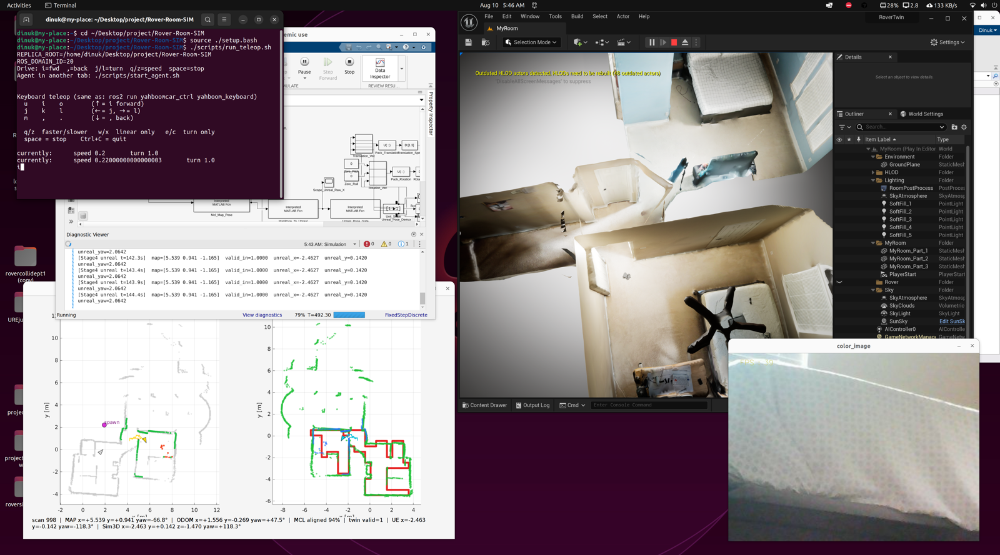

# Rover-Room-SIM — Yahboom micro-ROS digital twin

This project builds a **digital twin** of a real Yahboom micro-ROS rover and runs **co-simulation**: the physical robot and an Unreal Engine twin operate at the same time, driven by the same commands and kept aligned through map-based localization.

The real robot publishes lidar and odometry over ROS 2. MATLAB/Simulink localizes the rover on a saved room map (MCL) and moves the Unreal **RoverTwin** to match. You teleop the hardware in one terminal while watching the virtual room track the real pose.

---

## Project goal

| Layer | Role |
|-------|------|
| **Real robot** | Drives in the physical room; publishes `/scan`, `/odom`; accepts `/cmd_vel` |
| **ROS 2 + micro-ROS agent** | Bridges the ESP32 over Wi‑Fi (UDP) into the PC ROS graph |
| **MATLAB / Simulink** | MCL localization on a saved map; transforms pose into Unreal coordinates |
| **Unreal Engine (RoverTwin)** | Visual digital twin in a scanned copy of the room |

**Co-sim workflow:** one teleop stream drives the real rover; MCL tracks where it is on the map; Simulink updates the Unreal twin so both move together in parallel.



---

## Flash firmware (drive board)

```bash
# Wi-Fi: config/wifi.env
source ./setup.bash
./scripts/flash_firmware.sh
```

---

## Rover dual control (Stage 4 co-sim)

**Rover dual control** is the Simulink model that runs MCL localization and drives the Unreal digital twin while the real robot is teleoped over ROS.

Prerequisites:

- Saved SLAM map from Stage 2 (`maps/rover_room_*.mat`)
- Unreal alignment file (`maps/unreal_alignment.mat`) from manual align
- Unreal **RoverTwin** project under `roversim/RoverTwin`
- micro-ROS agent running and robot responding

More detail: **`rover-dual/README.md`**

### Run co-sim (four terminals)

**Terminal 1 — robot link**

```bash
./scripts/start_agent.sh
./scripts/check_robot.sh
```

**Terminal 2 — Simulink (MCL + Unreal twin)**

```matlab
setup_rover_paths()
run_rover_dual_control()
```

**Terminal 3 — teleop the real rover**

```bash
source ./setup.bash
./scripts/run_teleop.sh
```

**Terminal 4 — live camera**

```bash
source ./setup.bash
./scripts/show_camera_feed.sh
```
