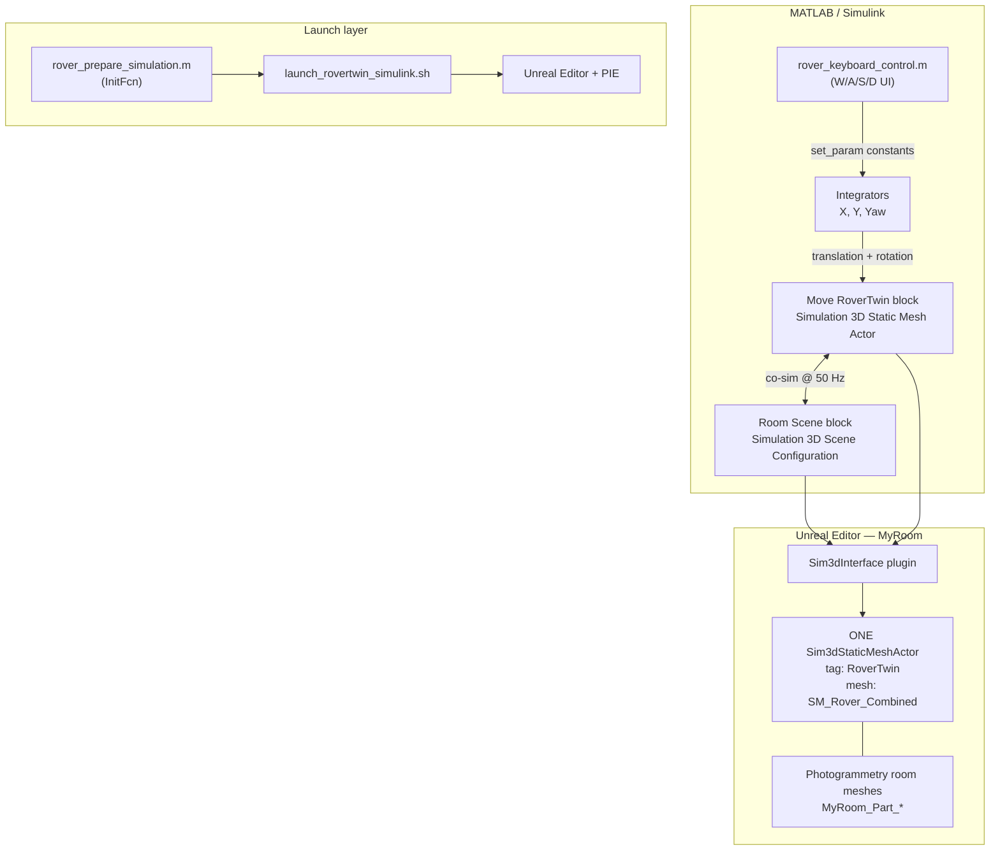

# Architecture overview

RoverTwin is a **co-simulation** between Simulink and Unreal Engine. Simulink computes rover commands each timestep; the MathWorks **Sim3dInterface** plugin applies those transforms to an actor in the Unreal level and returns actual pose feedback.

## System diagram



## Repository layout

```
RoverSIMUunreal-Linux (copy)main/
├── MATLAB/                    Simulink model + control code
│   ├── RoverTwinControl.slx   Interactive teleop model (generated)
│   ├── build_rover_control_model.m
│   ├── open_rover_control.m
│   ├── rover_keyboard_control.m
│   ├── rover_prepare_simulation.m
│   ├── rover_spawn_pose.m     ← single source of spawn coordinates
│   └── rover_unreal_project_alias.m
├── RoverTwin/                 Unreal project
│   ├── RoverTwin.uproject
│   ├── Content/Maps/MyRoom    Scanned room level
│   ├── Content/Rover/Meshes/  Rover static mesh
│   └── Config/DefaultEngine.ini  Sim3d game mode + plugins
├── scripts/                   Shell + Python level tools
│   ├── audit_rover_scene.py   ← canonical level repair
│   ├── run_audit_rover_scene.sh
│   ├── launch_rovertwin_*.sh  Simulink-driven editor launch
│   └── rover_spawn_pose.py
├── Linux/                     Packaged game launcher (optional)
└── docs/                      This documentation
```

## The one-actor rule (critical)

MathWorks expects **one Simulink-controlled actor** matched by **one Unreal actor tag**.

| Layer | Name | Must match |
|-------|------|------------|
| Unreal actor label | `RoverTwin` | — |
| Unreal actor tag | `RoverTwin` | Simulink `ActorTag` |
| Simulink block | `Move RoverTwin` | `ActorControl = on` |
| Simulink parameter | `ControlledActor` | `RoverTwin` |

**Do not use** these experimental actors (deprecated in this repo):

- `RoverVisible` — visible physics proxy
- `RoverActual` — Transform Get feedback proxy
- `RoverConstraint` — physics spring between ghost and visible
- Extra `Sim3dStaticMeshActor` or plain `StaticMeshActor` with rover mesh

Having two rover meshes is the main reason the keyboard shows movement while the visible rover stays frozen: Simulink moves actor A; you watch actor B.

## Co-simulation timing

| Setting | Value |
|---------|-------|
| Simulink fixed step | 0.02 s (50 Hz) |
| Scene Configuration `Ts` | 0.02 |
| Static Mesh Actor sample time | 0.02 |
| Unreal fixed frame rate | 200 Hz (engine setting; co-sim steps lock to Simulink) |

Block execution order in the model:

1. `Move RoverTwin` — priority **2** (runs first)
2. `Room Scene` — priority **1**

MathWorks recommends actor-move blocks run before Scene Configuration.

## Project path alias (spaces workaround)

The repo path contains spaces. Simulink/Unreal tooling is sensitive to that, so before each run:

`rover_unreal_project_alias.m` creates:

```
/tmp/RoverTwinUnrealProject  →  symlink to repo root
```

Simulink's Scene Configuration block points at:

```
/tmp/RoverTwinUnrealProject/RoverTwin/RoverTwin.uproject
```

The Simulink launcher uses the same alias via `launch_rovertwin_simulink.sh`.

## Unreal plugins (required)

From `RoverTwin.uproject`:

| Plugin | Role |
|--------|------|
| **MathWorksSimulation** | Sim3dInterface, `Sim3dStaticMeshActor`, co-simulation |
| **MathWorksAutomotiveContent** | Optional MathWorks assets |
| **PythonScriptPlugin** | Level audit/repair scripts, MCP remote execution |
| **SunPosition** | Lighting / sky (level dependency) |

Game mode in `DefaultEngine.ini`:

- `Sim3dGameInstance`
- `Sim3dGameMode`
- `Sim3dLevelScriptActor` — creates/registers Sim3D actors when Simulink connects

## What is *not* in scope (current design)

- No wheel physics or suspension model
- No ROS bridge
- No separate “visible vs ghost” rover chain
- Kinematic teleport of one rigid mesh (collision flag on block output port 3, not full physics)

## Related docs

- [Startup sequence](startup-sequence.md) — runtime order of operations
- [Verification checklist](verification-checklist.md) — confirm healthy state
