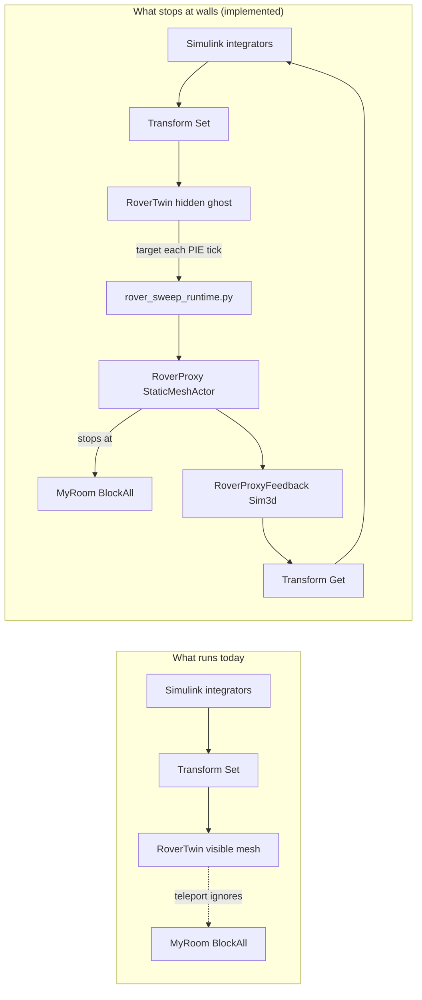

# Rover collision challenges (Simulink + custom Unreal scene)

Why wall collision feels like it *should* be easy but still fails in this project — and how others actually solve it with custom photogrammetry scenes.

---

## TL;DR — canonical solution (locked)

| Actor | Type | Role |
|-------|------|------|
| **RoverTwin** | `Sim3dStaticMeshActor` | Hidden ghost — Simulink **Transform Set** teleports here |
| **RoverProxy** | **`StaticMeshActor`** | Visible `SM_Rover_Combined` — moved by **Python sphere sweep** in PIE |
| **RoverProxyFeedback** | `Sim3dStaticMeshActor` | Hidden — tag `RoverProxy` — **Transform Get** reads swept pose |

**Do not switch to Blueprint.** `BP_RoverProxy` was tried and abandoned (empty mesh, save confusion). **Do not place `RoverSweepDriver` in the level** — Python uclasses are transient and break World Partition save.

**One sentence:** Simulink teleports the hidden ghost through walls; `rover_sweep_runtime.py` sweeps the visible `StaticMeshActor` proxy each PIE frame so it stops at `MyRoom` BlockAll geometry.

Setup (editor open):

```bash
bash scripts/run_setup_rover_scene.sh
```

See [rover-architecture.md](./rover-architecture.md).

---

## TL;DR — why you used to drive through walls

| What you have now | What collision needs |
|-------------------|----------------------|
| Simulink **Transform Set** teleports `RoverTwin` every 20 ms | Unreal must **resolve** movement against walls (sweep or physics) |
| Room meshes have **BlockAll** (step B — done ✓) | ✓ Walls can block something |
| Visible rover **is** the teleported `Sim3dStaticMeshActor` | Teleport **ignores** collision even if `BlockAllDynamic` is set |
| `RoverProxyFeedback` reads pose from ghost | Feedback follows ghost through wall — not swept position |
| **`BP_RoverProxy` + Event Tick sweep** | **Abandoned** — use `StaticMeshActor` + Python PIE sweep instead |

**One sentence:** Turning on collision on meshes does nothing if Simulink still **teleports** the same actor you see. Collision only applies when Unreal **moves** the mesh with sweep or physics.

Your screenshot (rover embedded in the blue wall while sim runs) is exactly this: Transform Set placed the actor inside/over the wall; Unreal did not block that move.

---

## How MathWorks + Unreal co-simulation actually works

MathWorks documents two different ideas that are easy to mix up:

### 1. Visualization path (what we use)

```
Simulink integrators  →  Simulation 3D Actor Transform Set  →  actor pose in Unreal
```

- Updates position/rotation **directly** each step.
- Unreal treats this as a **kinematic teleport** (same as `SetActorTransform` without sweep).
- **Collision on the mesh does not stop the teleport.** The engine moves the actor to the commanded pose regardless of walls.

Reference: [Animate Custom Actors in the Unreal Editor](https://www.mathworks.com/help/sl3d/animate-custom-actors-in-the-unreal-editor.html) — custom actors receive transforms from Simulink via Transform Set; movement logic can live in C++ `Transform()` override, but default behavior is pose application.

### 2. Physics / collision path (what blocks walls)

MathWorks expects collision when **Unreal’s physics** or **collision-aware movement** owns the final pose:

| Approach | MathWorks surface | Collision |
|----------|-------------------|-----------|
| `sim3d.Actor` with `Physics=true`, `Collisions=true` | MATLAB / Simulation 3D Actor block | Physics engine |
| `PreciseContacts=true` on ground/walls | Event / gravity examples | Accurate mesh contact |
| **Simulation 3D Vehicle with Ground Following** | Vehicle Dynamics / AD toolbox | Built-in ground + obstacles |
| Custom C++ `ASim3dActor` overriding `Transform()` | Bicycle / custom actor examples | You implement sweep/logic in UE |
| Unreal `SetActorLocation(..., sweep=true)` | Not a Simulink block — your Blueprint/C++ | Epic sweep API |

Reference: [sim3d.Actor — Physics, Collisions, PreciseContacts](https://www.mathworks.com/help/sl3d/sim3d.actor.html), [Report Events Using Actor Callbacks](https://www.mathworks.com/help/sl3d/report-events-using-actor-callbacks.html).

**Industry pattern for custom scenes:** Simulink sends **desired velocity or target**, Unreal applies **sweep or physics**, then **feeds actual pose back** via Transform Get.

---

## Why custom photogrammetry scenes (MyRoom) are harder than demo maps

Demo MathWorks maps (highway, parking lot) are authored for simulation: clean collision, known scale, flat floors.

**MyRoom** is a LiDAR/photogrammetry scan:

| Challenge | Effect |
|-----------|--------|
| **Complex mesh geometry** | Simple box collision misses walls; need **Complex as Simple** on each `MyRoom_Part_*` |
| **Huge scale (100×)** | Spawn/collision bounds easy to get wrong; Simulink saturation limits are approximate |
| **Floor not at Z=0** | Walkable surface at `(125, 80, -147)` cm — misalignment looks like clipping |
| **Thin / noisy walls** | Rover mesh can interpenetrate before sweep stops |
| **World Partition / HLOD warnings** | Usually visual LOD only; can confuse debugging |

Step B (BlockAll + Complex as Simple on room parts) fixes **whether walls are solid**. It does **not** fix **whether the rover movement respects those solids**.

---

## What we tried in this project (and why each failed)

### Attempt 1 — Saturation in Simulink (`X/Y Saturate`)

- Soft axis limits from approximate room bounds.
- **Not collision** — wrong if spawn/heading changes; rover still slides along invisible box, not mesh.

### Attempt 2 — `BlockAllDynamic` on `RoverTwin`

- Audit script sets collision on the Sim3d actor.
- **Still teleported** by Transform Set every 20 ms → passes through walls.

### Attempt 3 — Ghost + spring + `RoverVisible` (physics constraint)

- Simulink teleports hidden ghost; visible actor pulled by spring; should stop at walls.
- **Problems:** ghost passes through → spring fights wall → jitter/drift; two meshes confusing; deprecated in this repo.
- Matches your earlier instinct: *“clever but still lets command actor pass through.”*

### Attempt 4 — `BP_RoverProxy` + sweep (**abandoned**)

Blueprint proxy was the original plan but failed in practice: empty BP mesh, type confusion with `StaticMeshActor`, and no saveable Event Tick graph. **Do not use.**

### Attempt 5 — `StaticMeshActor` + Python PIE sweep (**canonical**)

```
Transform Set  →  RoverTwin (hidden ghost, NoCollision)
PIE tick       →  rover_sweep_runtime.py sphere-sweeps RoverProxy StaticMeshActor
Transform Get  →  RoverProxyFeedback (Sim3d, attached to proxy)
```

| Piece | Status |
|-------|--------|
| Room BlockAll on `MyRoom_Part_*` | ✓ |
| Transform Set → `RoverTwin` | ✓ |
| Transform Get → `RoverProxy` (via feedback actor) | ✓ |
| `RoverProxy` = `StaticMeshActor` with mesh | ✓ |
| Sweep in PIE (no level Python actor) | ✓ |
| Level saves without transient actors | ✓ |

Run: `bash scripts/run_setup_rover_scene.sh`

### Attempt 6 — `RoverProxyFeedback` only (partial fix)

- Fixes Simulink error `[0×0]` on Transform Get (needs `Sim3dStaticMeshActor` tag).
- Attached to **RoverTwin ghost** → reports ghost pose, **not** wall-stopped pose.
- Collision feedback loop still open.

---

## How others solve this (online / MathWorks patterns)

### Pattern A — Official physics actor (simplest if it fits)

Use **Simulation 3D Actor** block (not Transform Set) with initialization script:

- `Physics = true`
- `Collisions = true`
- `Gravity = false` (for floor-following rover)
- Ground/floor: `PreciseContacts = true`

Example: [Simulate Actor with Gravity Property Using Simulink](https://www.mathworks.com/help/sl3d/simulate-actor-with-gravity-property-using-simulink.html) (ball on plane).

**Pros:** Documented, one actor.  
**Cons:** Less control over custom mesh + `/cmd_vel` unicycle; may need shape instead of imported rover mesh.

### Pattern B — Vehicle / ground-following blocks

**Simulation 3D Vehicle with Ground Following** — MathWorks handles contact with terrain.

**Pros:** Collision/ground built in.  
**Cons:** Needs vehicle-style setup; not a custom photogrammetry room out of the box.

### Pattern C — Custom C++ Sim3d actor (MathWorks custom actor workflow)

Extend `ASim3dActor`, override `Transform()` to apply movement with collision checks before committing pose.

Documented in [Animate Custom Actors in the Unreal Editor](https://www.mathworks.com/help/sl3d/animate-custom-actors-in-the-unreal-editor.html).

**Pros:** Full control; Simulink tag unchanged.  
**Cons:** Requires C++ plugin build; steeper than Blueprint.

### Pattern D — Blueprint proxy + sweep (what we chose)

Epic forum consensus: [`SetActorLocation` with `bSweep=true`](https://forums.unrealengine.com/t/how-do-you-build-a-custom-movement-solution-that-does-not-break-other-parts-of-unreal/2626809) stops at first blocking hit; teleport without sweep goes through everything.

**Pros:** No C++; works with Transform Set command + custom mesh.  
**Cons:** Must implement in UE; need separate Sim3d actor for Transform Get; must hide ghost mesh.

This matches your earlier spec:

> Simulink commands velocity/target → Unreal moves with sweep → actual position back to Simulink.

---

## Current architecture vs target (diagram)



---

## Checklist — all must be true for collision to work

### Room (environment)

- [ ] Each `MyRoom_Part_*` and `GroundPlane`: **BlockAll**, **Query and Physics**
- [ ] **Use Complex Collision As Simple** on scan meshes
- [ ] Test: physics cube dropped in PIE **rests on wall**, does not fall through

### Rover movement (Unreal)

- [ ] **Visible** rover is `RoverProxy` **StaticMeshActor** (not the Transform Set ghost)
- [ ] `rover_sweep_runtime.py` active in PIE (`SWEEP_PIE|active` in Output Log)
- [ ] Rover proxy: **NoCollision** on mesh; wall stop comes from **sphere sweep in code**

### Simulink

- [ ] Transform **Set** → `RoverTwin` (command / ghost)
- [ ] Transform **Get** → `RoverProxy` (**Sim3dStaticMeshActor**, not Blueprint tag alone)
- [ ] Feedback actor **attached to swept proxy**, not ghost
- [ ] Optional: clamp integrators from **actual** pose each step (closed loop)

### Process

- [ ] After any model rebuild: **`open_rover_control`** (reload `.slx`)
- [ ] Unreal **Play** before / during Simulink Run
- [ ] Launch project via **`/tmp/RoverTwinUnrealProject`** symlink (spaces in Desktop path break map load)

---

## Setup (one command)

Editor open on MyRoom, Remote Execution enabled:

```bash
bash scripts/run_setup_rover_scene.sh
```

Then: Play in UE → `open_rover_control` in MATLAB → Run Simulink.

Optional closed loop: feed actual `(x,y,yaw)` from Transform Get back into integrators.

---

## FAQ

### “Collision is on — why doesn’t it work?”

Collision only affects **physics simulation** and **sweep/move queries**. Transform Set **sets world transform directly** — it is not a sweep. Same as calling teleport in Unreal.

### “MathWorks docs mention collision — aren’t we using it?”

Yes, but on **`sim3d.Actor` / Simulation 3D Actor** with **`Physics=true`**, not on raw Transform Set of a static mesh actor.

### “Is our URDF the problem?”

No. URDF only built the visual mesh. Motion is pure unicycle integration + Transform Set ([rover-motion-and-commands.md](./rover-motion-and-commands.md)).

### “Why did Transform Get crash with [0×0]?”

Transform Get only reads **`Sim3dStaticMeshActor`** registered with Sim3dInterface. Tag `RoverProxy` on a Blueprint alone does not work — need `RoverProxyFeedback` Sim3d actor ([setup_rover_proxy_feedback.py](../scripts/setup_rover_proxy_feedback.py)).

### “Why does keyboard show command inside wall but sim keeps running?”

Command pose = integrators (open loop). Actual pose = Transform Get. If Get is attached to ghost, both can show “inside wall” while mesh clips. After sweep proxy, **actual** should stop at wall even if command keeps going — until you close the loop on integrators.

---

## References

| Source | Topic |
|--------|--------|
| [Create 3D Simulations in Unreal Engine Environment](https://www.mathworks.com/help/sl3d/create-3d-simulation-in-unreal-engine-environment.html) | Physics, events, custom scenes |
| [sim3d.Actor Physics / Collisions / PreciseContacts](https://www.mathworks.com/help/sl3d/sim3d.actor.html) | When collision actually runs |
| [Animate Custom Actors in the Unreal Editor](https://www.mathworks.com/help/sl3d/animate-custom-actors-in-the-unreal-editor.html) | Transform Set + custom C++ actors |
| [Epic forums — custom movement + sweep](https://forums.unrealengine.com/t/how-do-you-build-a-custom-movement-solution-that-does-not-break-other-parts-of-unreal/2626809) | `SetActorLocation` sweep vs teleport |
| [rover-proxy-blueprint.md](./rover-proxy-blueprint.md) | Our Blueprint sweep steps |
| [rover-motion-and-commands.md](./rover-motion-and-commands.md) | Keyboard → Simulink → Unreal pipeline |

---

## Bottom line

**It should not be difficult** once the split is clear:

- **Simulink** owns *desired* motion (integrators, `/cmd_vel`).
- **Unreal** owns *final* motion against your custom scene via **Python sphere sweep** on a **`StaticMeshActor` proxy**.
- **Transform Set alone** cannot be both.

**Actor types are fixed** — do not alternate between Blueprint and StaticMeshActor. Use `run_setup_rover_scene.sh` if anything drifts.
