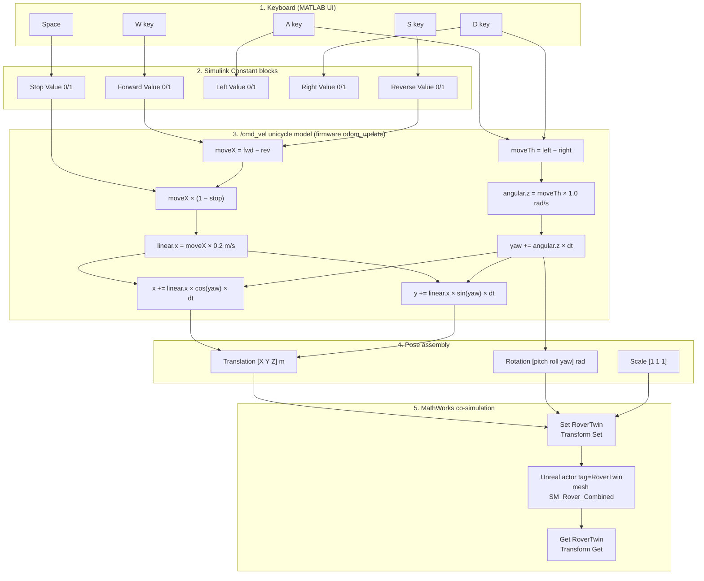

# Rover motion and command pipeline

This document explains **how keyboard commands become rover motion**, what the **URDF file actually controls**, why motion can still look wrong, and **what is missing** for a physically correct drive model.

If W/S or A/D feel reversed, or the rover slides sideways after turning, read this before changing random sign flips in Simulink.

---

## TL;DR

| Question | Answer |
|----------|--------|
| Does the URDF tell Simulink how to move? | **No.** URDF is used only when exporting the combined mesh (`SM_Rover_Combined`). |
| What should drive the sim? | The **same command interface as the real robot**: `/cmd_vel` → `linear.x`, `angular.z`. |
| What does the sim do now? | Keyboard → `/cmd_vel` values → **unicycle integrator** (same math as ESP firmware `odom_update`) → Transform Set → Unreal mesh. |
| Where are the numbers defined? | `MATLAB/rover_cmd_vel_config.m` (copied from `~/Desktop/project/Rover-Room-SIM` teleop defaults). |
| What is still not simulated? | Wheel motors, traction, slip, suspension — Unreal only displays the integrated pose. |

---

## Physical robot vs simulation (the gap we closed)

Your physical integration project (`~/Desktop/project/Rover-Room-SIM`) already does the right thing:

```
Keyboard  →  geometry_msgs/Twist on /cmd_vel
                linear.x  [m/s]
                angular.z [rad/s]
           →  ESP Motion_Ctrl(linear.x, 0, angular.z)
           →  wheels spin on the real robot
           →  firmware odom_update() integrates pose for /odom
```

The Unreal twin now uses the **middle kinematics layer** from that stack:

```
Keyboard (W/A/S/D)
    →  linear.x = (W−S) × 0.2 m/s
    →  angular.z = (A−D) × 1.0 rad/s     ← same sign as teleop_keyboard.py / matlab_connect.m
    →  yaw += angular.z × dt
    →  x += linear.x × cos(yaw) × dt
    →  y += linear.x × sin(yaw) × dt
    →  Transform Set → Unreal mesh
```

**Source files copied/adapted from physical project:**

| This repo | Physical project source |
|-----------|-------------------------|
| `MATLAB/rover_cmd_vel_config.m` | `matlab_connect.m`, `teleop/teleop_keyboard.py` defaults |
| `MATLAB/rover_kinematics.m` | `esp/.../lidar_publisher/main/main.c` → `odom_update()` |
| `build_rover_control_model.m` | Same equations wired as Simulink blocks |

**Not copied (different purpose in physical project):**

| Physical-only | Why not in Unreal twin |
|---------------|------------------------|
| ROS 2 Publish `/cmd_vel` | Sim has no ESP; optional future block |
| ROS 2 Subscribe `/odom` | Sim integrates pose locally instead |
| `Simulation 3D Vehicle with Ground Following` | Needs Automated Driving toolbox; we use Transform Set + custom mesh |
| `importrobot(URDF)` in `matlab_connect` | Visualization only on real robot UI |

---

## Big picture



**Important:** There is no arrow from `MicroROS.urdf` into this diagram. The URDF is offline geometry only.

---

## Step 1 — Keyboard to Simulink constants

**File:** `MATLAB/rover_keyboard_control.m`

While `RoverTwinControl` is **running**, key presses call `set_param` on five Constant blocks:

| Key | Block | Value when pressed |
|-----|-------|-------------------|
| W | `Forward Value` | 1 |
| S | `Reverse Value` | 1 |
| A | `Left Value` | 1 |
| D | `Right Value` | 1 |
| Space | `Stop Value` | 1 |

Each value is **0 or 1** (not analog). Multiple keys can be active (e.g. W+D = forward while turning right).

The UI also reads feedback for display:

| Display line | Source blocks | Meaning |
|--------------|---------------|---------|
| `command X/Y/yaw` | `X Saturate`, `Y Saturate`, `Yaw` integrator outputs | What Simulink **integrators** think the pose is |
| `actual X/Y/yaw` | `Actual X/Y/Yaw` Gain blocks wired to **Transform Get** | What Unreal **reports back** each step |
| `set X/Y/Z` | `Pack Translation` | Translation vector sent to Transform Set this step |

If **command** changes but **actual** does not → co-sim not driving the visible actor (run audit).  
If **command yaw** and **actual yaw** diverge while turning → rotation wiring/units bug (see below).

---

## Step 2 — How constants become motion commands

**File:** `MATLAB/build_rover_control_model.m` (regenerate with `build_rover_control_model`)

### Forward / reverse (W / S) → `linear.x`

```
moveX = Forward Value − Reverse Value          →  +1, 0, or −1
moveX = moveX × (1 − Stop Value)               →  zero when Space held
linear.x = moveX × 0.2                         →  m/s (rover_cmd_vel_config)
```

Positive `linear.x` = forward on the **real robot** and in the sim integrator.

### Turn left / right (A / D) → `angular.z`

```
moveTh = Left Value − Right Value              →  +1, 0, or −1
angular.z = moveTh × 1.0                       →  rad/s
```

This matches physical teleop: **A / j / ← → positive `angular.z` (turn left)**.

Previous sim used `right − left`, which inverted turn direction vs the real robot.

### Pose integration (same as ESP firmware)

From `lidar_publisher/main/main.c` → `odom_update()`:

```
yaw += angular.z × dt
x   += linear.x × cos(yaw) × dt
y   += linear.x × sin(yaw) × dt
```

Implemented in Simulink as discrete integrators at `dt = 0.02 s`, and in `rover_kinematics.m` for unit tests.

---

## Step 3 — Velocity and position integrators

Simulink uses a **planar unicycle (bicycle) model** in the **Simulation 3D world frame**:

```
vx = speed × cos(yaw)
vy = speed × sin(yaw)
X  = ∫ vx dt
Y  = ∫ vy dt
Z  = constant (spawn height from rover_spawn_pose.m)
```

Assumptions baked into this math:

1. **Yaw is about world Z** (vertical axis).
2. **At yaw = 0, forward motion is world +X** (before the −0.65 sign hack).
3. **Standard math angle**: yaw increases counter-clockwise when viewed from above.
4. **No side-slip** — holonomic point mass, not a wheeled robot.

This is **not** differential-drive kinematics from the URDF wheel joints.

### Room bounds (soft clamp)

After integration, X and Y pass through Saturation blocks (metres):

- X ∈ [−5.00, 3.50]
- Y ∈ [−5.00, 3.65]

These are outer room mesh limits, not from URDF.

---

## Step 4 — Transform Set (Simulink → Unreal)

**Block:** `Set RoverTwin` — `Simulation 3D Actor Transform Set`  
**ActorTag:** `RoverTwin` (must match the single actor in MyRoom)

Each 20 ms step Simulink sends:

| Port | Signal | Current model |
|------|--------|---------------|
| 1 | Translation | `[X, Y, Z]` metres — from position integrators + fixed Z |
| 2 | Rotation | `[pitch, roll, yaw]` **radians** — `[0, 0, yaw_integrator]` |
| 3 | Scale | `[1, 1, 1]` |

The `Simulation 3D Actor Transform Set` block uses rotation order **`[pitch, roll, yaw]`** — pitch about Y (index 1), roll about X (index 2), **yaw about Z (index 3)**. This is the order documented on the MathWorks block reference page (shared across Vehicle Dynamics Blockset, Aerospace Blockset, and Simulink 3D Animation): the `Rotation` array columns are pitch, roll, yaw.

> ⚠️ The internal `GamingEngineUnknown.m` in the MATLAB install carries a stale comment `Rotation of the actor [pitch,yaw,roll]`. That comment does **not** match the block the model uses — trust the block reference: **yaw is index 3.**

### Past bug (why motion looked “impossible”)

An earlier model wired the yaw integrator into rotation **index 2 (the roll slot)**. Then:

- **A/D** tilted/banked the mesh (roll) instead of turning in the floor plane.
- **W/S** still used yaw in `cos/sin`, so translation did not match the visible (rolled) mesh — the rover appeared to slide sideways / move impossibly.

The current builder puts yaw on **port-2 index 3**. If you still see sideways tilting when pressing A/D, the model may not have been rebuilt — run `open_rover_control` (not the raw `.slx`).

---

## Step 5 — Transform Get (Unreal → Simulink feedback)

**Block:** `Get RoverTwin` — `Simulation 3D Actor Transform Get`

| Port | Output | Used for |
|------|--------|----------|
| 1 | Translation `[X, Y, Z]` m | `Actual X/Y/Z` display |
| 2 | Rotation `[pitch, roll, yaw]` rad | `Actual Pitch/Roll/Yaw` display |
| 3 | Extra | Terminated |

Demux wiring (current):

- Index 1 → pitch  
- Index 2 → roll  
- Index 3 → **yaw** (this is what the keyboard UI shows as actual yaw)  

**Transform Get is read-only for display.** It does not close the loop on velocity. W/S always use the **open-loop yaw integrator**, not the yaw read back from Unreal.

---

## Step 6 — Unreal actor and mesh

**Level repair:** `scripts/audit_rover_scene.py`

| Property | Value |
|----------|-------|
| Class | `Sim3dStaticMeshActor` |
| Tag | `RoverTwin` |
| Mesh | `/Game/Rover/Meshes/SM_Rover_Combined` |
| Spawn | `(125, 80, −147)` cm — from `rover_spawn_pose.m` |
| Initial rotation | `(0, 0, 0)` pitch/yaw/roll |

Simulink does **not** spawn a new mesh each run. It **teleports** the pre-placed actor every step. There is no wheel physics, suspension, or collision response in the current design. See **[rover-collision-challenges.md](./rover-collision-challenges.md)** for why walls still do not stop the rover and what is missing.

---

## What the URDF actually does

**Files:**

- `RoverTwin/Content/Rover/Source/MicroROS.urdf`
- `buildrover/SourceAssets/Rover/MicroROS.urdf`

**Used by:** `build_rover_import.py` only.

### URDF contents (relevant parts)

| URDF concept | This rover |
|--------------|------------|
| `base_link` | Main body frame; SolidWorks exporter origin |
| Wheel links | `zq`, `yq`, `yh`, `zh` — continuous joints, rotation about **Y** axis |
| Forward direction in URDF | **+X** (front wheels at +X ≈ 0.0455 m, rear at −X ≈ 0.0495 m) |
| Drive joints | Wheel spin axes — **never sent to Simulink** |
| Arm joints | `jq1`, `jq2` revolute — cosmetic for mesh pose at export |

### Export pipeline

```
MicroROS.urdf
    → build_rover_import.py walks link tree, applies joint origins
    → STL parts → transformed OBJ parts in Content/Rover/Import/
    → SM_Rover_Combined.obj (single merged mesh for Unreal)
    → imported in UE as static mesh asset
```

The script:

1. Applies URDF joint transforms in **URDF frame** (X forward, Y left, Z up).
2. Scales **metres → centimetres** (`× 100`).
3. Does **not** apply an Unreal-specific axis permutation (no Y flip).

So the mesh in Unreal keeps URDF **+X as mesh local +X**. Unreal world is left-handed (Y right), but that affects how **left/right** looks in the viewport, not how Simulink indexes X/Y.

### What URDF does **not** do

- Not loaded at simulation runtime  
- Not used for wheel speeds or turn radius  
- Not used to validate that W means “forward along base_link +X”  
- Not connected to ROS / micro-ROS in this project  

**Expecting URDF to fix teleop direction is a category error** — the gap is between the **assumed unicycle model** and the **imported mesh + Sim3D rotation conventions**, not missing URDF parsing.

---

## Three frames you must keep straight

### 1. URDF / mesh local frame (export time)

- +X forward (nose / radar direction)  
- +Y left  
- +Z up  
- Units at export: centimetres in OBJ  

Measured bounds of `SM_Rover_Combined.obj`:

| Axis | Extent (cm) | Notes |
|------|-------------|-------|
| X | ~20 | Longest — body length |
| Y | ~15 | Wheel track |
| Z | ~12 | Height |

Centroid is **not** at mesh origin `(0,0,0)` — pivot offset can make rotation look wrong if you expect spin about geometric centre.

### 2. Simulation 3D / Simulink world frame

- Metres  
- Same axis mapping as Unreal world: `sim = ue_cm / 100` on X, Y, Z (no Y sign flip)  
- Spawn: `(1.25, 0.80, −1.47)` m  

Canonical file: `MATLAB/rover_spawn_pose.m`

### 3. Simulink assumed body frame (control math)

- Yaw about Z  
- Forward unit vector at yaw ψ: `(cos ψ, sin ψ, 0)` in world XY  
- **ψ = 0 ⇒ forward = +X world** (then scaled by `Linear Speed`, currently negative)  

There is **no automatic alignment step** that measures mesh forward and sets `ψ_offset`.

---

## Why problems persist — checklist

Use this when motion still feels wrong after rebuild.

### A. Forward / reverse swapped (W vs S)

| Cause | What to check |
|-------|----------------|
| Sign hack wrong for your mesh | Flip `Linear Speed` gain between `+0.65` and `−0.65` in `build_rover_control_model.m` |
| Mesh imported with 180° yaw offset | Set non-zero spawn yaw in Unreal **and** matching integrator IC (not implemented — see “Missing pieces”) |
| Watching wrong actor | Run audit — duplicate rovers cause “moving ghost” |

### B. Left / right swapped or inverted (A vs D)

| Cause | What to check |
|-------|----------------|
| Turn rate sign | Flip `Turn Rate` gain `1.2` → `−1.2` |
| Sim3D yaw sign vs integrator | Compare **command yaw** vs **actual yaw** on keyboard UI while holding D |
| Rotation still on wrong axis | If rover **tilts** instead of turning, rotation vector order is wrong — rebuild model |

### C. Forward wrong **after** turning

| Cause | What to check |
|-------|----------------|
| Yaw integrator ≠ Transform Set yaw | command yaw and actual yaw should track; if not, rotation port/units bug |
| Velocity uses different yaw than rotation | Current design uses same integrator for both — should be consistent after rotation fix |
| Open-loop drift | No feedback correction; large errors mean Set/Get disagree |

### D. Slides sideways / “impossible” paths

| Cause | What to check |
|-------|----------------|
| Roll/pitch accidentally driven | actual pitch/roll should stay ~0 while driving |
| Mesh pivot offset | Rotation around actor origin ≠ geometric centre |
| Mixing old Static Mesh Actor model | `rover_model_ok` must pass — use `open_rover_control` |

---

## What we are missing (honest gap analysis)

These are the pieces **not in the repo** that a URDF-aware robot stack would normally provide.

### 1. Mesh forward calibration (highest priority)

**Missing:** A measured constant `mesh_forward_yaw_offset_rad` applied consistently to:

- Spawn rotation in Unreal  
- Yaw integrator initial condition  
- Optionally velocity frame  

**Today:** We only have an ad-hoc `Linear Speed = −0.65` sign flip.

**Proper fix:** In Unreal editor, note which world direction the mesh nose points at spawn rotation zero. Set offset in `rover_spawn_pose.m` (e.g. `pose.yaw_deg = 180`) and rebuild.

### 2. URDF-based drive kinematics

**Missing:** Mapping `(v, ω)` or `(left_wheel_rate, right_wheel_rate)` from URDF wheel geometry:

```
track width, wheel radius, joint axes from zq/yq/yh/zh joints
→ differential drive: v, ω → wheel speeds
```

**Today:** Holonomic `(vx, vy)` from yaw — wheels do not spin; URDF continuous joints are decorative.

### 3. Closed-loop heading (optional but robust)

**Missing:** Drive velocity from **Transform Get yaw** (with one-step delay) so W/S always follow **visible** heading even if Set/Get have small bias.

**Today:** Open-loop yaw integrator only.

### 4. Single calibration struct

**Missing:** One file, e.g. `rover_kinematics.m`:

```matlab
pose.linear_speed_mps = 0.65;
pose.turn_rate_rps = 1.2;
pose.forward_sign = -1;      % mesh vs +X
pose.yaw_sign = 1;         % A/D vs Unreal
pose.mesh_yaw_offset_deg = 0;
```

**Today:** Magic numbers scattered in `build_rover_control_model.m`.

### 5. Rotation unit verification

**Risk:** Transform Set may expect radians (current assumption) while some MathWorks docs still mention degrees for older Static Mesh Actor blocks.

**Missing:** Automated test comparing 90° command to actual Get feedback.

### 6. Documentation / model sync

Several older docs still describe:

- `Move RoverTwin` Static Mesh Actor (removed)  
- Rotation as `[Roll Pitch Yaw]` degrees (wrong for current Transform Set)  
- Spawn Y as `−0.80` m (fixed — now `+0.80`)  

Always trust **`build_rover_control_model.m`** and **`rover_spawn_pose.m`** over stale markdown.

---

## How to verify a run (minimal protocol)

1. **Rebuild model**

   ```matlab
   cd('.../MATLAB')
   open_rover_control   % not RoverTwinControl.slx directly
   ```

2. **Repair level**

   ```bash
   bash scripts/run_audit_rover_scene.sh
   ```

3. **Run co-sim**, open keyboard window.

4. **At rest:** command ≈ actual ≈ `(1.25, 0.80, −1.47)` m, yaw ≈ 0°.

5. **Hold D only:** command yaw and actual yaw should both increase (or both decrease — but **same sign**). Rover should rotate in plane, not bank sideways.

6. **Hold W only:** rover moves along its visible nose. If it moves backward, flip `Linear Speed` sign and rebuild.

7. **After 90° turn, hold W:** still moves along nose, not crab-walking.

Optional MATLAB diagnostic:

```matlab
rover_diagnose_pose_only   % samples command vs set vs actual during run
```

---

## Recommended fix order (when tuning)

1. Confirm **one** `RoverTwin` actor (audit).  
2. Confirm **Transform Set/Get** architecture (`rover_verify_model`).  
3. Fix **rotation vector** `[pitch, roll, yaw]` on port 2 (yaw at index 3) — rebuild.  
4. Tune **`Linear Speed` sign** for W forward.  
5. Tune **`Turn Rate` sign** for D = turn right (or left — pick one convention).  
6. Add **`mesh_yaw_offset`** to spawn if nose does not align with +X at zero yaw.  
7. Longer term: replace unicycle integrators with URDF wheel kinematics if you need realistic skid-steer.

---

## File reference

| File | Role in motion pipeline |
|------|-------------------------|
| `MATLAB/rover_keyboard_control.m` | W/A/S/D → Constant blocks; reads actual/command pose |
| `MATLAB/build_rover_control_model.m` | Full kinematics + Transform Set/Get wiring |
| `MATLAB/rover_spawn_pose.m` | Spawn translation (metres / cm) |
| `MATLAB/RoverTwinControl.slx` | Generated model — do not hand-edit |
| `RoverTwin/Content/Rover/Source/MicroROS.urdf` | Robot description for mesh export only |
| `RoverTwin/Content/Rover/Source/build_rover_import.py` | URDF → OBJ merge |
| `scripts/audit_rover_scene.py` | Single Sim3dStaticMeshActor at spawn |
| `docs/coordinate-systems.md` | Axis conversion rules |

---

## Related docs

- [Coordinate systems](coordinate-systems.md) — metres vs cm, spawn pose  
- [Simulink controller](simulink-controller.md) — block diagram (partially outdated — see note above)  
- [Architecture overview](architecture-overview.md) — co-sim and one-actor rule  
- [Verification checklist](verification-checklist.md) — pre-flight checks  
- [Troubleshooting](troubleshooting.md) — common failures  
