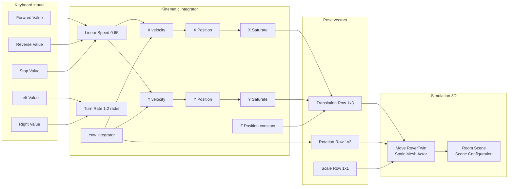

# Simulink controller

The model **`RoverTwinControl`** (file `MATLAB/RoverTwinControl.slx`) is generated by `build_rover_control_model.m`. Regenerate after editing that script:

```matlab
build_rover_control_model
```

## Block diagram (logical)



## Key blocks

### Room Scene (`Simulation 3D Scene Configuration`)

| Parameter | Value |
|-----------|-------|
| Project format | Unreal Editor |
| UE project path | `/tmp/RoverTwinUnrealProject/RoverTwin/RoverTwin.uproject` |
| Scene path | `/Game/Maps/MyRoom` |
| Sample time `Ts` | 0.02 |
| Vehicle tag | `Scene Origin` (free camera; not rover follow) |
| Free camera translation | Above spawn XY, Z = +4 m |

Camera does **not** chase `RoverTwin` by default (avoids race at startup before actor registers).

### Move RoverTwin (`Simulation 3D Static Mesh Actor`)

| Parameter | Value |
|-----------|-------|
| ActorTag | `RoverTwin` |
| ActorControl | `on` |
| ControlledActor | `RoverTwin` |
| Mobility | Moveable |
| InitialPos | From `rover_spawn_pose.m` → `[1.25, -0.8, -1.47]` m |
| InitialRot | `[0 0 0]` |
| Sample time | 0.02 |

**Inputs (from Simulink):**

1. Translation — `[X Y Z]` metres, row vector `1×3`
2. Rotation — `[Roll Pitch Yaw]` degrees, row vector `1×3`
3. Scale — `[1 1 1]`

**Outputs (from Unreal / Sim3D feedback):**

1. Location — actual `[X Y Z]` metres
2. Orientation — actual `[Roll Pitch Yaw]` degrees
3. Collision flag

Outputs feed scopes and `Actual Position Demux` / `Actual Yaw Demux` for debugging.

### Motion model (simplified teleop)

| Input | Effect |
|-------|--------|
| W | Forward integrator (+X body frame) |
| S | Reverse |
| A / D | Yaw rate ±1.2 rad/s |
| Space | Stop gate (zero linear command) |

Body-frame velocity mapped to world frame via `cos(yaw)` / `sin(yaw)`.

Saturation limits (soft room bounds, metres):

- X: −5.00 … 3.50
- Y: −5.00 … 3.65

Z is fixed at spawn height from `rover_spawn_pose`.

## Model callbacks

| Callback | Function | Role |
|----------|----------|------|
| InitFcn | `rover_prepare_simulation` | Launch UE, open keyboard, trigger PIE |
| StopFcn | `rover_stop_simulation` | Reset keyboard commands |

## Keyboard UI (`rover_keyboard_control.m`)

Opened during InitFcn. While simulation is **running**:

**Writes to model:**

```
RoverTwinControl/Forward Value  → 0 or 1
RoverTwinControl/Reverse Value
RoverTwinControl/Left Value
RoverTwinControl/Right Value
RoverTwinControl/Stop Value
```

**Reads for display:**

| Line | Source | Meaning |
|------|--------|---------|
| `actual X/Y/yaw` | `Move RoverTwin` ports 1–2 | What Sim3D reports from Unreal |
| `command X/Y/yaw` | `X Saturate`, `Y Saturate`, `Yaw` | What integrators command |

If **actual** never changes but **command** does → duplicate actor or co-sim not driving the visible mesh (run audit).

## Source files (MATLAB/)

| File | Role |
|------|------|
| `open_rover_control.m` | Entry point — load/build model |
| `build_rover_control_model.m` | Programmatic model generator |
| `rover_keyboard_control.m` | W/A/S/D UI + pose display |
| `rover_prepare_simulation.m` | InitFcn launcher |
| `rover_stop_simulation.m` | StopFcn cleanup |
| `rover_spawn_pose.m` | Spawn coordinates (Simulink + docs) |
| `rover_unreal_project_alias.m` | `/tmp` symlink for UE path |
| `test_*.m` | Development tests for block dimensions |

## Related docs

- [Coordinate systems](coordinate-systems.md)
- [Unreal scene](unreal-scene.md)
