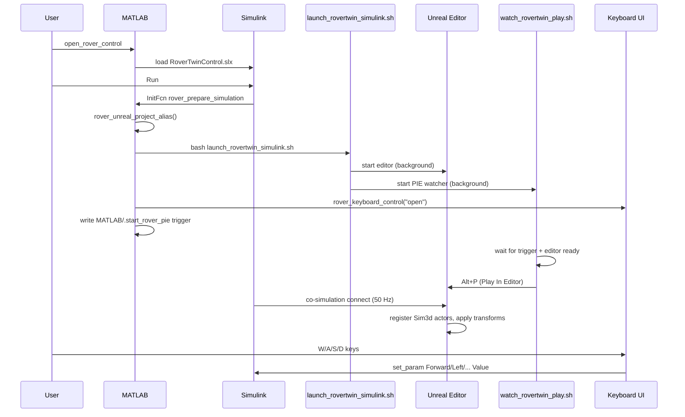

# Startup sequence

What happens when you run the simulation from MATLAB.

## Prerequisites

1. Unreal Engine 5.3 installed (default path: `/home/dinuk/UnrealEngine_5.3`)
2. MATLAB R2024b with Simulation 3D / `sim3dlib` blocks
3. Level audited: `bash scripts/run_audit_rover_scene.sh` (one `RoverTwin` in MyRoom)
4. Simulink model built: `build_rover_control_model` if you changed `build_rover_control_model.m`

## Step-by-step



### 1. `open_rover_control`

- Adds `MATLAB/` to path
- Loads or builds `RoverTwinControl.slx`
- Opens the model in Simulink

### 2. User clicks **Run**

Simulink calls **InitFcn** → `rover_prepare_simulation.m`:

| Action | File |
|--------|------|
| Create no-space project symlink | `rover_unreal_project_alias.m` |
| Set `MATLABROOT`, cosim env vars | `rover_prepare_simulation.m` |
| Kill old editor, start new one | `scripts/launch_rovertwin_simulink.sh` |
| Open keyboard window | `rover_keyboard_control("open")` |
| Signal PIE watcher | writes `MATLAB/.start_rover_pie` |

### 3. `launch_rovertwin_simulink.sh`

- Symlinks repo to `/tmp/RoverTwinUnrealProject`
- Kills any running `UnrealEditor`
- Starts `launch_rovertwin_editor.sh` in background with map `/Game/Maps/MyRoom`
- Starts `watch_rovertwin_play.sh` in background

**Important:** this launcher must **not** pass `-ExecutePythonScript` to the editor. That flag runs a script and then quits the editor, breaking co-simulation.

### 4. `launch_rovertwin_editor.sh`

- Sets `LD_LIBRARY_PATH` for UE, ChaosVehicles, MathWorksSimulation, MATLAB libs
- Sets `ROVER_UE_COSIM=1`
- Execs `UnrealEditor` with `RoverTwin.uproject` and `MyRoom`

### 5. `watch_rovertwin_play.sh`

Waits until:

1. Trigger file `MATLAB/.start_rover_pie` exists
2. Log shows `Total Editor Startup Time`
3. Unreal window title matches `RoverTwin - Unreal Editor`

Then sends **Alt+P** to start Play-In-Editor (PIE). Success is logged as `SIMULINK_PIE_STARTED` in `RoverTwin/Saved/Logs/SimulinkEditorLaunch.log`.

### 6. Co-simulation

With Scene Configuration **Project format = Unreal Editor**:

- Simulink blocks until you play in the editor (or watcher auto-plays)
- Each 0.02 s step: translation/rotation sent to `RoverTwin` actor
- `Move RoverTwin` output ports return actual location, orientation, collision flag

Typical log lines (`RoverTwin.log`):

```
CreateActorsInScene - Creating actor StaticMeshActorRoverTwin ...
An actor with the tag RoverTwin registered with Sim3dInterface.
```

The internal name `StaticMeshActorRoverTwin` is the Simulink-side registration; your **level** should still have only one pre-placed `RoverTwin` tagged actor (see [Unreal scene](unreal-scene.md)).

### 7. Keyboard teleop

`rover_keyboard_control.m` polls at 5 Hz and:

- **Sends:** `set_param` on `Forward Value`, `Reverse Value`, `Left Value`, `Right Value`, `Stop Value`
- **Reads actual pose:** `Move RoverTwin` output ports (Sim3D feedback)
- **Reads command pose:** `X Saturate` / `Y Saturate` / `Yaw` integrators

Press **Escape** → `SimulationCommand = stop` on the model.

### 8. Stop

**StopFcn** → `rover_stop_simulation.m` → resets keyboard commands (`rover_keyboard_control("reset")`).

## Logs to inspect

| Log | Purpose |
|-----|---------|
| `RoverTwin/Saved/Logs/SimulinkEditorLaunch.log` | Editor boot, PIE auto-start |
| `RoverTwin/Saved/Logs/RoverTwin.log` | Sim3dInterface, actor registration |
| `RoverTwin/Saved/Logs/AuditRoverScene.log` | Last level audit result |

## Related docs

- [Simulink controller](simulink-controller.md)
- [Verification checklist](verification-checklist.md)
